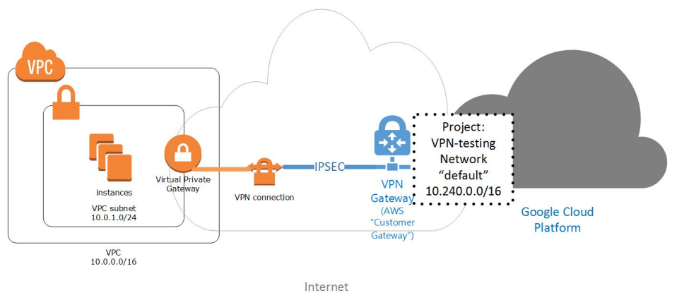
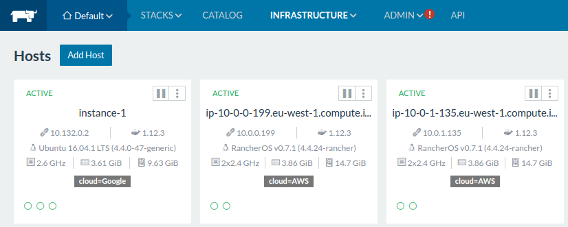
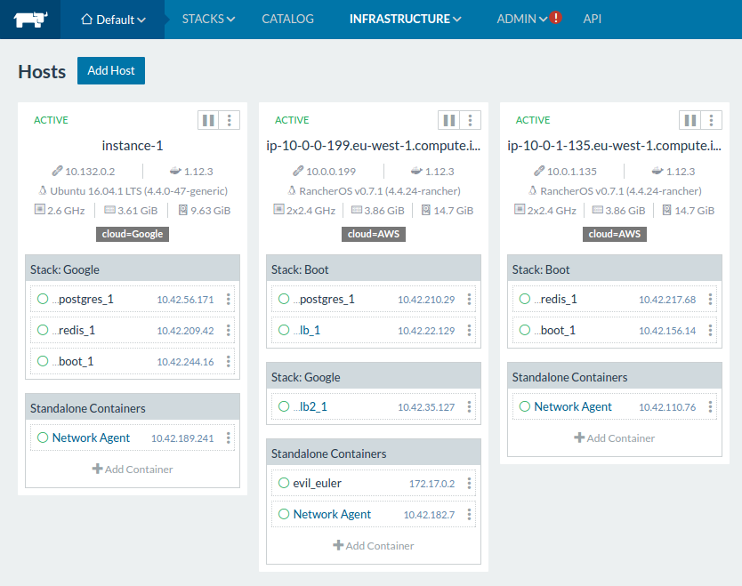

## Attack your cloud bill: a hybrid cloud strategy with Rancher, AWS and Google

AWS is a [10 billion](http://www.recode.net/2016/4/28/11586526/aws-cloud-revenue-growth){:target="_blank"} a year business. It's not surprising at all, the speed of innovation, the plethora of services truly make it the market leader.

I always had an itch though that if only I could carve out some of my workloads and quickly run it on a VPS, or give Google Cloud a chance. 

I had very productive bizdev calls with the Google Cloud folks (hey Robin!) and [voices of the internet](https://thehftguy.com/2016/11/18/google-cloud-is-50-cheaper-than-aws/){:target="_blank"} also say that there might be a price advantage of using them. 
The [custom machine types](https://cloud.google.com/compute/docs/machine-types#custom_machine_types){:target="_blank"} sure look interesting. 

There is more to consider than price of course, but if you have the kind of bill, 
the ability to experiment with hosting can yield monthly an FTE in **cloud bill reduction**.

## Cloud agnostic

It requires a cloud agnostic setup though. 

Luckily it is more viable these days having **Docker as the common ground in infrastructure**. 

In this article I show you how to unify the advantages of AWS and Google's Cloud Platform, using [Rancher](http://rancher.com/){:target="_blank"} - a thin layer atop of various container scheduler engines - to provide a transparent workflow for deploying on them.

>You had the ability for some time in the VM space to abstract cloud providers - [using CloudFoundry](https://www.mendix.com/blog/new-cloud-foundry-based-mendix-cloud-runs-globally-aws/?utm_content=buffer69519&utm_medium=social&utm_source=linkedin.com&utm_campaign=buffer){:target="_blank"} - 
and other container platforms are also emerging besides Rancher. 
Like Kubernetes, your very own Paas construction kit, if you prefer that route.

## Secure foundations

I started by laying down foundations for network communication. Luckily AWS is attacking the enterprise market full front, thus provides VPN connection to connect other networks to their cloud.

Following this [guide from Google (!pdf)](https://cloud.google.com/files/CloudVPNGuide-UsingCloudVPNwithAmazonWebServices.pdf) it was easy to hook into the [AWS Virtual Private Gateway](http://docs.aws.amazon.com/AmazonVPC/latest/UserGuide/VPC_VPN.html) and have it all managed by the cloud providers for 0.05$ an hour per connection. 
Calculate with double though as redundant connections are supported out of the box, and you can route traffic back and forth between your subnets. 

## Rancher

Rancher's infrastructure page is a delight for people loving hardware. 

Adding hosts to your Swarm, Kubernetes, Mesos or Cattle backed cluster is nothing more than running the rancher-agent container on any node you have access to. Rancher takes care of configuring the cluster for you. Great service if you think of the number of moving parts in Kubernetes for example.

If you prefer you can provide access keys for Rancher and it will spin up nodes on virtually any cloud/VPS provider too.

For this example I used Rancher's custom orchestration engine, Cattle, and tagged the nodes with their respective cloud provider tag. Later on I will use these labels to control where my stack is deployed.

 

In this Cattle environment there are two nodes in an AWS private subnet and a single node in Google's Cloud while the Rancher server is also running in AWS. They are communicating through the Rancher overlay network which requires UDP ports 500 and 4500 to be accessible on the hosts. Thus the AWS security group was configured accordingly. 10.132.0.0/20 is the Google subnet and sg-f5b23593 where the Rancher hosts run in AWS.

## Deploying your docker-compose.yml

Once ping was running between the nodes across clouds, the fun began.

I regard Docker Compose the centerpiece of the Docker revolution and was a bummer when I realized that Docker Swarm (aka Docker Engine in swarm mode) doesn't let me control my services through compose files. I was relieved though when all that worked in Rancher out of the box: **in Rancher you deploy your *stacks* through Docker Compose files**.

<pre>
boot:
  image: laszlocph/springboot-demo
  links:
    - postgres
    - redis
  labels:
    io.rancher.scheduler.affinity:host_label: cloud=AWS
postgres:
  image: postgres
  environment:
    - POSTGRES_DB=..
    - POSTGRES_USER=..
    - POSTGRES_PASSWORD=...
  labels:
    io.rancher.scheduler.affinity:host_label: cloud=AWS
redis:
  image: redis
  labels:
    io.rancher.scheduler.affinity:host_label: cloud=AWS
</pre>

The above is a standard Docker Compose file, with custom labels that control Rancher's scheduling engine. Hats off Rancher, this is a much nicer integration to the ecosystem than the json files [I had to write for Amazon ECS](https://laszlo.cloud/Mastering-test-environments-with-Docker).

## The final picture

I deployed my dummy stack two times, once to the AWS nodes, and once to the Google nodes, just by changing the scheduler affinity in the compose file shown above. As you can see the containers in AWS were deployed evenly on the two nodes, while in the single node Google environment they concentrate on the one node available. 

 

I also deployed a load balancer - a Rancher infrastructure service - to serve traffic from the world. I made sure they get scheduled to the node that allows public access on certain ports. Rancher's overlay network (note the *Network agent* containers) makes sure that the load balancer can communicate with the other nodes.

## Further possibilities

I am extremely happy about this setup. While one can enjoy the managed Docker cluster options both from Amazon and Google ([ECS](https://aws.amazon.com/ecs/) and [GCE](https://cloud.google.com/container-engine/)), standardizing on Docker and orchestrating with Rancher one can achieve great flexibility: 

* experimentation with different providers is a good route to savings. Not forgetting that not being locked in to a certain vendor yields significantly better position in negotiations.
* One can also spin up QA clusters on premise or move certain background workloads to cheap VPS providers (hello [Packet](https://www.packet.net/bare-metal/){:target="_blank"})
* also, it opens up new disaster recovery possibilities.

Onwards!
